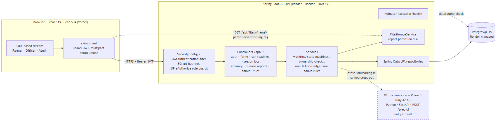

# Crop Advisory & Farming Guidance Platform


A web platform connecting farmers with agricultural officers for advisory requests, disease
reporting and soil-driven guidance — replacing informal phone-call advisory with a structured,
trackable workflow.

- **Frontend:** React 19 + Vite + Tailwind CSS 4
- **Backend:** Spring Boot 3.3 (Java 17) + Spring Security + JWT
- **Database:** PostgreSQL 15

---

## Live Demo

| Component | URL |
|---|---|
| Web app | https://crop-advisory-platform.vercel.app |
| REST API | https://cropadvisory-backend-08uh.onrender.com/api |
| Health check | https://cropadvisory-backend-08uh.onrender.com/actuator/health |
| API docs (Swagger UI) | https://cropadvisory-backend-08uh.onrender.com/swagger-ui.html |

> **The first request may take up to ~90 seconds.** The backend runs on Render's free tier, which
> spins the container down after 15 minutes of inactivity. Open the health check link a minute or
> two before a demo to wake it; subsequent requests are instant.

---

## Overview

Farmers frequently lack timely, personalised agronomic advice, while extension officers have no
structured way to triage or record the requests they receive informally. This platform gives both
sides a single place to work:

- Farmers register farms, log soil readings and season history, and raise advisory requests or
  disease reports.
- Officers work a queue of requests and reports, respond with guidance, and drive each item through
  its status workflow.
- Admins manage users, curate a crop/disease knowledge base and view platform analytics.

## Features

- **Authentication** — signup/login with JWT, `BCryptPasswordEncoder` password hashing, and a
  `role` claim driving role-based access (`FARMER` / `OFFICER` / `ADMIN`).
- **Farm management** — create and list farm profiles (location, size, soil type) per farmer.
- **Soil readings** — log N, P, K, pH, rainfall and temperature per farm over time.
- **Season history** — record the crop sown each season and how it turned out.
- **Advisory requests** — farmer submits; officer assigns, responds, then closes.
  Status machine: `PENDING → ASSIGNED → RESPONDED → CLOSED`.
- **Disease reports** — farmer reports a crop issue; officer reviews and resolves.
  Status machine: `REPORTED → UNDER_REVIEW → RESOLVED`.
- **Officer queue** — all requests and reports, including unassigned ones, in one view, with a
  status filter and sorting by age (newest/oldest) or by status.
- **Admin module** — manage user accounts and roles, curate the crop/disease knowledge base, and
  view platform analytics (users by role, requests per week, most reported issues).
- **Ownership enforcement** — farmers can only reach their own farms' data; officers and admins can
  read any farm. Enforced in the service layer, not just the UI.

---

## Architecture



The React SPA calls the Spring Boot REST API over HTTPS with a bearer JWT. The API persists to
PostgreSQL through Spring Data JPA and exposes `/actuator/health` for the platform health check.
See [`docs/diagram/`](docs/diagram/) for the ER and class diagrams.

---

## Tech Stack

| Layer | Technology |
|---|---|
| Frontend | React 19, Vite 8, Tailwind CSS 4, React Router 7, Axios |
| Backend | Spring Boot 3.3.5, Java 17, Spring Web, Spring Data JPA |
| Auth | Spring Security, JWT (jjwt 0.12.5), BCrypt |
| Database | PostgreSQL 15 |
| API docs | springdoc-openapi (`/swagger-ui.html`) |
| Build | Maven (wrapper included), npm |
| Testing | JUnit 5, Mockito, JaCoCo |
| CI/CD | GitHub Actions |
| Hosting | Render (API + Postgres), Vercel (SPA) |

---

## Getting Started

### Prerequisites

- **Java 17** (`java -version`)
- **Node.js 20.19+ or 22.12+** — required by Vite 8 (`node -v`)
- **PostgreSQL 15** running locally, or **Docker** to use the bundled compose file

Maven is not required — the Maven wrapper (`./mvnw`) is committed.

### 1. Start the database

```bash
docker compose up -d db
```

This starts PostgreSQL 15 on `localhost:5432` with database `crop_advisory`, user `postgres` and
password `password123` — matching the backend's built-in defaults, so no configuration is needed
for local development.

### 2. Run the backend

```bash
cd backend
./mvnw spring-boot:run
```

The API starts on http://localhost:8080. Verify it with:

```bash
curl http://localhost:8080/actuator/health
```

### 3. Run the frontend

```bash
cd frontend
cp .env.example .env.local
npm ci
npm run dev
```

The app runs on http://localhost:5173, which is the backend's default allowed CORS origin.

### Overriding configuration locally

The backend has working defaults for local development, so `.env` is optional. **Spring Boot does
not read `.env` files on its own** — to apply overrides, export them into your shell first:

```bash
cp .env.example .env     # then edit the values you need
set -a && source .env && set +a
cd backend && ./mvnw spring-boot:run
```

Alternatively, set the variables in your IDE's run configuration.

### Running the tests

```bash
cd backend && ./mvnw test          # unit tests + coverage gate
cd frontend && npm run lint        # ESLint
cd frontend && npm run build       # production build
```

JaCoCo enforces a **minimum 40% line coverage on the `service` package**, so `./mvnw test` fails if
coverage drops below it. The current figure is **92.6%**, and a full HTML report is written to
`backend/target/site/jacoco/index.html`.

> The `contextLoads` integration test needs a reachable PostgreSQL instance. It will fail locally
> unless the database from step 1 is running; CI provides one automatically.

---

## Environment Variables

### Backend

| Variable | Required | Default | Description |
|---|---|---|---|
| `DB_URL` | No | `jdbc:postgresql://localhost:5432/crop_advisory` | JDBC connection URL |
| `DB_USER` | No | `postgres` | Database user |
| `DB_PASSWORD` | No | `password123` | Database password |
| `DATABASE_URL` | Production | — | Single connection string injected by Render (`postgresql://…`). `DataSourceConfig` normalises it to JDBC form and extracts the credentials, so `DB_*` is unnecessary when it is set |
| `JWT_SECRET` | Production | placeholder | HMAC signing key. Must be **≥256 bits (32+ characters)** or startup fails. Generate with `openssl rand -base64 32` |
| `JWT_EXPIRATION_MS` | No | `86400000` | Token lifetime in milliseconds (24 hours) |
| `FRONTEND_URL` | Production | `http://localhost:5173` | Comma-separated CORS origins, **no trailing slash**. Must list every origin that calls the API |
| `DDL_AUTO` | No | `update` | Hibernate schema mode (`update`, `validate`, `create-drop`). Use `validate` in production |
| `SHOW_SQL` | No | `false` | Log every SQL statement |
| `ADMIN_EMAIL` | No | — | Creates the first ADMIN account on startup. Requires `ADMIN_PASSWORD` too, and is skipped once any admin exists. See [Admin bootstrap](#admin-bootstrap) |
| `ADMIN_PASSWORD` | No | — | Password for the bootstrapped admin account. Set both or neither |
| `PORT` | No | `8080` | HTTP port. Render injects this automatically |

### Frontend

| Variable | Required | Default | Description |
|---|---|---|---|
| `VITE_API_BASE_URL` | Yes | `http://localhost:8080/api` | Backend base URL, **including the `/api` suffix**. Inlined at build time by Vite — it is not a secret |

Both `.env` files are gitignored. Templates are provided at [`.env.example`](.env.example) and
[`frontend/.env.example`](frontend/.env.example).

### Admin bootstrap

Signup only offers `FARMER` and `OFFICER`, so the admin role cannot be self-registered. To create
the first admin, set `ADMIN_EMAIL` and `ADMIN_PASSWORD` and start the application — `AdminSeeder`
creates that account once, and then does nothing on subsequent restarts:

```bash
ADMIN_EMAIL=admin@example.com ADMIN_PASSWORD='a-strong-password' ./mvnw spring-boot:run
```

On Render, set both in the dashboard (the Blueprint declares them with `sync: false`, so no
credentials live in the repository). If the email already belongs to a non-admin account, the
seeder deliberately does **not** promote it — change that user's role from the admin user list
instead.

---

## API Documentation

Interactive Swagger UI is served by springdoc-openapi:

- Local: http://localhost:8080/swagger-ui.html
- Deployed: https://cropadvisory-backend-08uh.onrender.com/swagger-ui.html

Public endpoints are `/api/auth/**`, `/actuator/health` and the Swagger/OpenAPI paths. Everything
else requires an `Authorization: Bearer <token>` header.

---

## Deployment

The stack runs as three pieces: a Render web service (API), a Render PostgreSQL instance, and a
Vercel static site (SPA). Both platforms deploy automatically from `main` through their own Git
integrations, so no deploy secrets are needed in GitHub Actions.

### Backend — Render

[`render.yaml`](render.yaml) is a Blueprint that defines both the API service and the database.

1. In the Render dashboard choose **New → Blueprint** and connect this repository.
2. Render reads `render.yaml` and provisions:
   - `cropadvisory-backend` — Docker runtime, built from [`backend/Dockerfile`](backend/Dockerfile)
   - `cropadvisory-db` — the PostgreSQL instance, with `DATABASE_URL` wired into the service
3. Confirm the service's environment variables (the Blueprint sets them):

   | Key | Value |
   |---|---|
   | `SPRING_PROFILES_ACTIVE` | `prod` |
   | `FRONTEND_URL` | `https://crop-advisory-platform.vercel.app,http://localhost:5173` |
   | `JWT_SECRET` | generated by Render (`generateValue: true`) |
   | `JWT_EXPIRATION_MS` | `86400000` |
   | `DDL_AUTO` | `update` |
   | `DATABASE_URL` | from the `cropadvisory-db` database |
   | `ADMIN_EMAIL` | set manually (declared `sync: false`) |
   | `ADMIN_PASSWORD` | set manually (declared `sync: false`) |

4. The health check path is `/actuator/health`. Once it reports `{"status":"UP"}`, the API is live.

### Frontend — Vercel

1. Import the repository into Vercel.
2. Set **Root Directory** to `frontend`.
3. Add the environment variable for all environments (Production, Preview, Development):

   ```
   VITE_API_BASE_URL = https://cropadvisory-backend-08uh.onrender.com/api
   ```

4. Deploy. [`frontend/vercel.json`](frontend/vercel.json) rewrites all routes to `index.html` so
   React Router deep links survive a page refresh.

> `VITE_API_BASE_URL` is inlined during the build, so changing it requires a **redeploy** rather
> than just a restart.

### Deployment notes

- **CORS:** the deployed frontend origin must appear in the backend's `FRONTEND_URL`, without a
  trailing slash. A missing origin surfaces as a browser CORS error, not a server error.
- **Cold starts:** the free tier sleeps after 15 minutes idle and can take ~90 seconds to wake.
- **Database credentials:** Render's `DATABASE_URL` includes the password and `DataSourceConfig`
  parses it apart. Never commit a real connection string.
- Full troubleshooting detail lives in [`RENDER_DEPLOYMENT.md`](RENDER_DEPLOYMENT.md).

---

## Project Structure

```
.
├── .github/workflows/       backend.yml (Maven build + test + coverage), frontend.yml (lint + build)
├── backend/
│   ├── src/main/java/com/college/cropadvisory/
│   │   ├── config/          SecurityConfig, JwtTokenProvider, JwtAuthenticationFilter,
│   │   │                    DataSourceConfig, AdminSeeder
│   │   ├── controller/      REST endpoints (thin — no business logic)
│   │   ├── service/         business logic and authorization
│   │   ├── repository/      Spring Data JPA interfaces
│   │   ├── model/entity/    User, Farm, SoilReading, SeasonLog, AdvisoryRequest, DiseaseReport, KnowledgeBaseEntry
│   │   ├── dto/             request/response objects
│   │   └── exception/       typed exceptions + GlobalExceptionHandler
│   ├── src/test/java/       JUnit 5 unit tests (mirrors main structure)
│   └── Dockerfile           multi-stage build used by Render
├── frontend/
│   ├── src/api/             Axios client plus per-module service functions
│   ├── src/components/      farms, soil, season, advisory, disease, officer queues, admin
│   ├── src/context/         authContext (context + useAuth), AuthProvider
│   ├── src/hooks/           useFetch
│   ├── src/pages/           Login, Signup, dashboards
│   └── vercel.json          SPA rewrite configuration
├── docs/diagram/            architecture, ER and class diagrams
├── docker-compose.yml       local PostgreSQL 15
├── render.yaml              Render Blueprint (API + database)
├── RENDER_DEPLOYMENT.md     deployment and troubleshooting guide
├── CHANGELOG.md             release history
└── LICENSE                  MIT
```

---

## Design Documents

- [Problem Statement](docs/Problem_Statement.md) — scope, roles, entities and success criteria
- [Architecture diagram](docs/diagram/architecture-diagram.png)
- [ER diagram](docs/diagram/er-diagram.png)
- [Class diagram](docs/diagram/class-diagram.png)
- [Deployment guide](RENDER_DEPLOYMENT.md)
- [Changelog](CHANGELOG.md)

---

## License

Released under the [MIT License](LICENSE).

© 2026 Suhail Subbhan.
